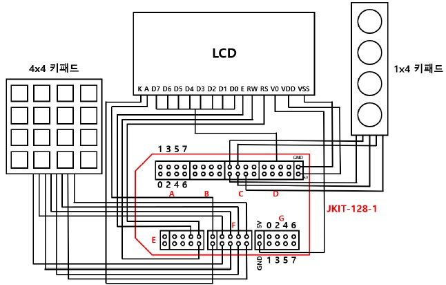

# Microprocessor Term Project

## 역할

| 팀원   | 업무                                                     |
| ------ | -------------------------------------------------------- |
| 김경민 | 코딩(LCD), 회로 설계, 테스트, 하드웨어 제작, 보고서 작성 |
| 김현창 | 코딩(LCD 외 나머지), 회로 설계, 리팩토링, 시연 영상 제작 |

---

## 회로도

---

## 결과물

- [시연영상](https://youtu.be/-dTAxCWks7Y)

